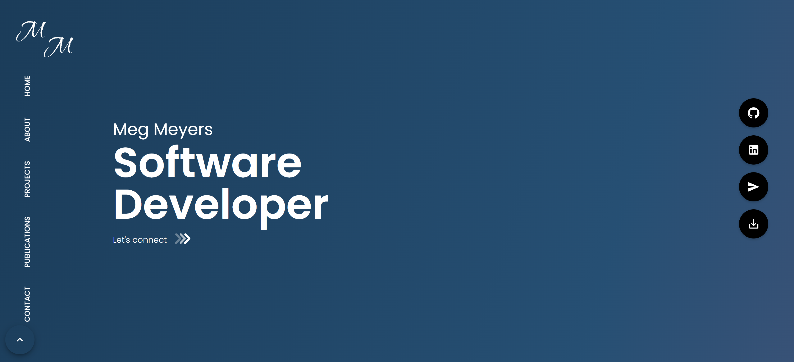

# My Professional Portfolio

    

## Description ✏️

My software developer portfolio. Performance optimized with Vite PWA Plugin and Webpack. Downloadable.

## Table of Contents 📖

[Installation](#installation)

[Usage](#usage)

[Issues](#known-issues)

[Credits](#credits)

[Questions](#questions)

## Installation

To install necessary dependencies, run the following command:

```
npm i
```

## Usage

Clone the repository, run the install command and then 'npm start'. Then navigate to the localhost port.

### Deployed Link

https://meg-meyers.netlify.app/

### Screenshots



---

## Known Issues

From contact page, trying to naviagte to publications section isn't working.

## Credits

## Questions

If you have any questions about the repo or notice any bugs you want to report, open an issue or contact me directly at megan.meyers.388@gmail.com.
